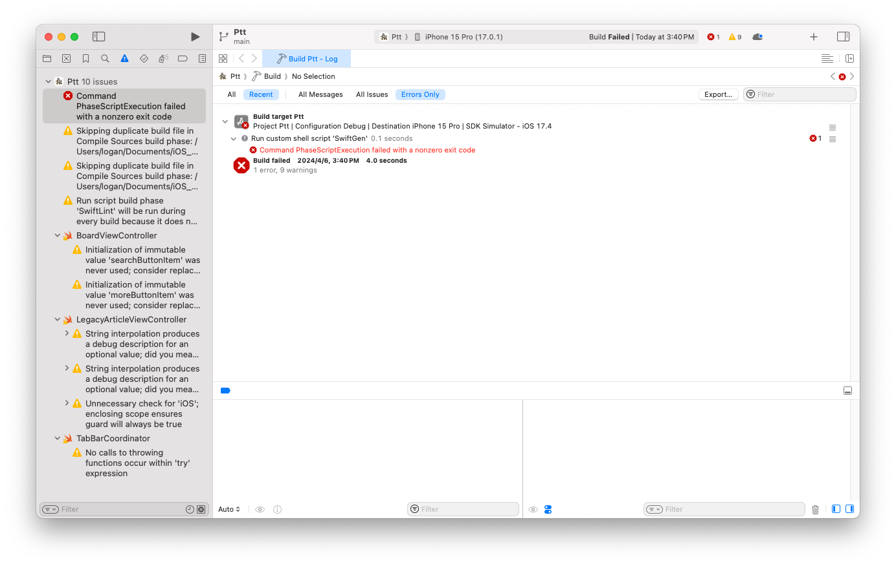

# Coding Guidelines

- How to join the project? Check out [our documentation](https://hackmd.io/bNV8xhVwQxOYnLt9NTRdFw).
- We are using [Swiftlint](https://github.com/realm/SwiftLint) to enforce Swift style and conventions
- We're using [PaintCode Plugin for Sketch](https://www.paintcodeapp.com/sketch) for vector image assets.

# Quick Start
* Clone or Download ZIP
* Build with Xcode, and make sure you've installed [SwiftGen](https://github.com/SwiftGen/SwiftGen/tree/stable?tab=readme-ov-file#installation) and [Swiftlint](https://github.com/realm/SwiftLint).
* If you encounter the error shown below when building, make sure there are no spaces in the path of the project folder.

# License

Licensed under the GPLv3: https://www.gnu.org/licenses/gpl-3.0.html

Additional Permissions For Submission to Apple App Store: Provided that you are otherwise in compliance with the GPLv3 for each covered work you convey (including without limitation making the Corresponding Source available in compliance with Section 6 of the GPLv3), Ptt also grants you the additional permission to convey through the Apple App Store non-source executable versions of the Program as incorporated into each applicable covered work as Executable Versions only under the Mozilla Public License version 2.0 (https://www.mozilla.org/en-US/MPL/2.0/).
